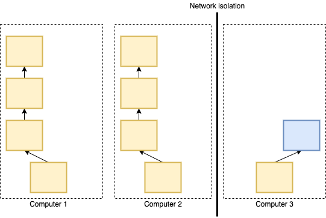

# Consensus

Consensus is agreeing upon one block and replicating across all the good computers. Bitcoin needs an algorithm that is resistant to attackers who have accessed the virtual machine software.

### Requirements:

* When generating new blocks, we need it to replicate to all ‘good’ nodes
* Newer blocks point to this new block
* Nodes can join or leave at any time
  * While maintaining consensus
  * Without causing deadlock
* Network partition tolerant
  * Each half forms a consensus
  * When the partition heals, so does the consensus

### Strawman Consensus Algorithm

We first start with the simple algorithm, whenever a computer adds a block, it will immediately notify its neighbors and they will add a block as well.

A fork will occur if two computers add a block simultaneously. We decided to pick randomly from the longest branches. Then, the fork will die as we continue with the longest branch.

### Livelock

Livelock might be formed if we add blocks faster than we learn about other blocks. The solution to this livelock is slowing down adding blocks by sleeping a random period chosen properly before adding a new block.

### Network Partition

Network partitions might cause an inconsistency when there is a network partition. The larger partition grows blockchain faster since they have more computers and timeouts on average will be shorter. When the network partitions heal, the shorter partitions will learn about the largest chain and replicate those blocks over to themselves.

&#x20;

<figure><figcaption></figcaption></figure>

The timeout value will be chosen empirically by measuring how often each new block arrives, and bitcoin changes timeout roughly every 14 days.

### Proof of Work

POW is a vehicle in which someone can effectively prove that they are engaged in a significant amount of computational effort. It depends on puzzles, which can be challenging to solve (require serious computational effort). Proof of work schemes have been proposed for deterring denial-of-service (DoS) attacks
