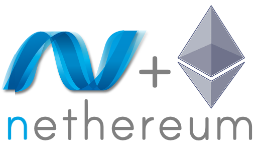

# Front End Tool

### [Web3.js](https://web3js.readthedocs.io/en/v1.8.0/)

[Web3.js](https://medium.com/coinmonks/web3-js-ethereum-javascript-api-72f7b22e2f0a) is a JavaScript library that interacts with the Ethereum blockchain. It enables us to make requests to each Ethereum node with JSON RPC to read and write data to the network. There are a couple of replacements for web3.js such as [Eth.js](https://github.com/ethjs), [Ethers.js](https://github.com/ethers-io/ethers.js/), and [Web3Wrapper](https://github.com/0xProject/0x-monorepo/tree/development/packages/web3-wrapper).&#x20;

### [EthereumJS](https://github.com/ethereumjs/)

### .png>)

EthereumJS is a collection of utility functions for Ethereum. It includes a variety of Javascript tools for implementing Ethereum technologies, protocols, and APIs for developers to interact with the Ethereum network and build new applications. Sample tools are [ethereumjs-util](https://github.com/ethereumjs/ethereumjs-util) and [ethereumjs-tx](https://github.com/ethereumjs/ethereumjs-tx).

### [Nethereum](https://github.com/Nethereum/)

### 

[Netherum](https://blockgeni.com/basics-of-nethereum/) is a cross-platform Ethereum development framework. It is an integration library created for Ethereum. It simplifies smart contract management and interacts with Ethereum nodes no matter they are public or private.&#x20;

### [Web3x](https://github.com/xf00f/web3x)

[Web3x](https://web3x.co/) is the typescript port of web3.js. It is benefitted from the small constructs and security during interactions.&#x20;
