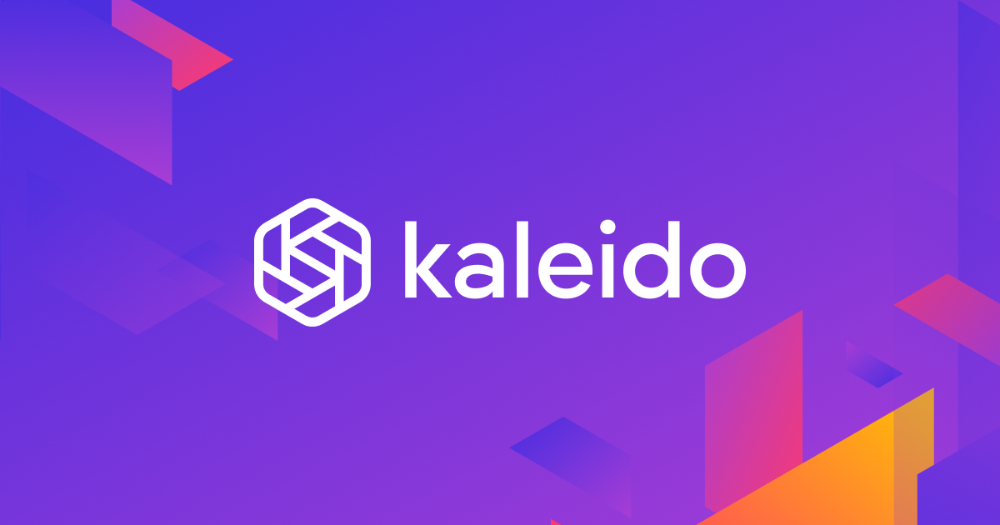

# Platform as a service(PaaS

### [Truffle Boxes](https://trufflesuite.com/boxes/)

[Truffle Boxes](platform-as-a-service-paas.md#truffle-boxes) is PaaS that contains everything you will need to help us build blockchain applications. It is a world-class development environment, testing framework, and asset pipeline for blockchains using the EVM (Ethereum Virtual Machine).&#x20;

### [Besu Private Network](https://besu.hyperledger.org/en/stable/Tutorials/Quickstarts/Azure-Private-Network-Quickstart/)&#x20;

An Ethereum client called [Besu Private Network](https://besu.hyperledger.org/en/stable/Tutorials/Quickstarts/Azure-Private-Network-Quickstart/) was created with enterprise-friendly use cases for both public and private networks. Additionally, it can be tested on test networks like Rinkeby, Ropsten, and Görli.

### [Kaleido](https://kaleido.io/)

With the help PaaS platform Kaleido, businesses can now implement blockchain and digital assets with ease. It builds multi-region, multi-cloud blockchain networks on protocols like Ethereum, Hyperledger Fabric, Quorum, Hyperledger Besu, and Corda is simple with Kaleido.

### [Blocknative](https://blocknative.com/)&#x20;

.png>)

[Blocknative](https://blocknative.com/) is the real-time Web3 infrastructure company, enabling dynamic user experiences and better decisions via pre-chain insights.

