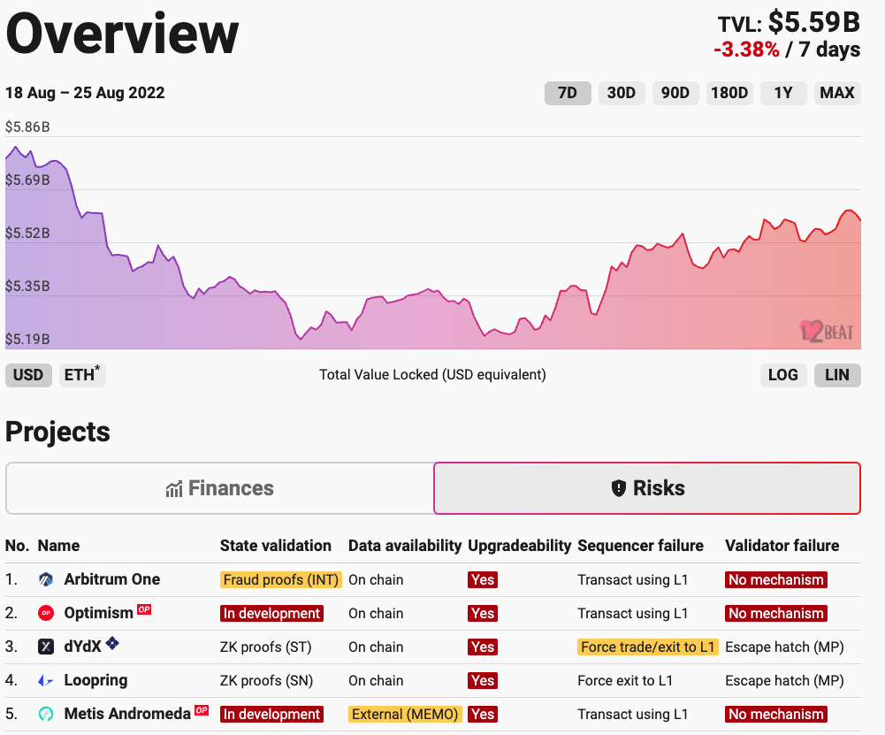

# L2 Tools

### L2 Fees

<figure><figcaption></figcaption></figure>

[L2 Fees](https://l2fees.info/) is a tool to query Layer2 transaction costs in real time.

### L2 BEAT&#x20;

<figure><figcaption></figcaption></figure>

[L2beat](https://l2beat.com/) is a Layer 2 Comparator that compares and keep track of different L2 projects in terms of their technology stack, system design, current Market Cap, Total Value Locked, and other indicators.

### **zkScan**

[zkScan](https://zkscan.io/) is a Block Explorer and Analytics Platform for zkSync**.**

<figure><figcaption></figcaption></figure>

### zk**E**xport

<figure><figcaption></figcaption></figure>

[ZkExport](https://zkexport.netlify.app/) is a trading information export tool, which can export all kinds of information on the chain to CSV format, which provides great convenience for data analysis.

\
