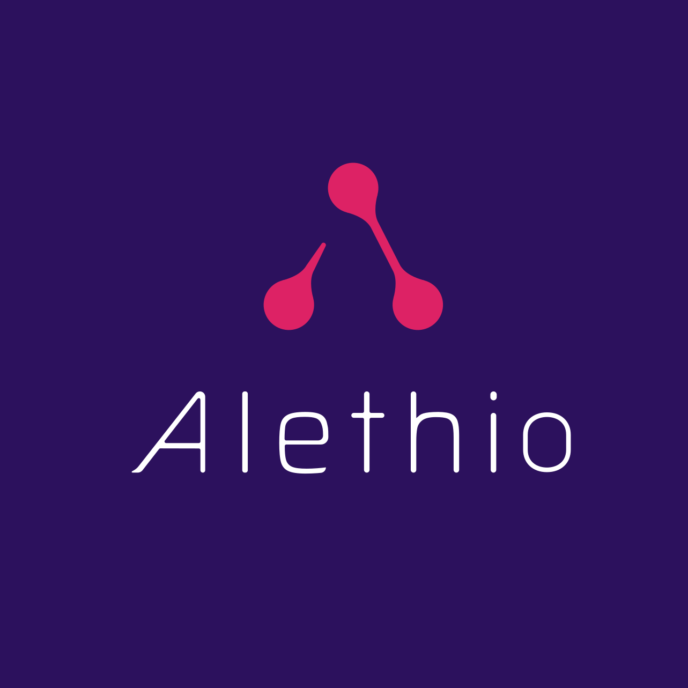
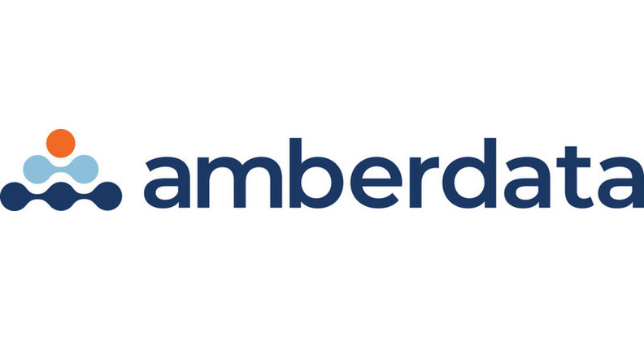
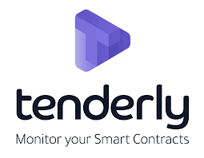

# Monitoring and Management

### [Alethio](https://aleth.io/)

Alethio is an advanced Ethereum analytics platform that provides real-time monitoring, insights and anomaly detection, token metrics, smart contract auditing, graph visualization, and blockchain search. It also explores real-time market information and trading activity on the Ethereum DEX.

### [Amberdata](https://amberdata.io/)

### 

Amberdata provides real-time monitoring, insight and anomaly detection, token metrics, smart contract auditing, graph visualization and blockchain search.

### [Tenderly](https://tenderly.co/)

### 

Tenderly is a platform that provides users with reliable smart contract monitoring and alerting in the form of a web dashboard without requiring users to host or maintain infrastructure.

