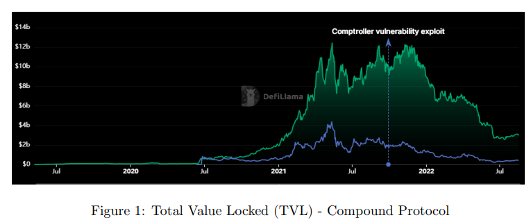
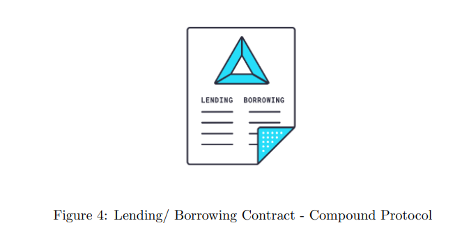

# Compound

**Introduction:**&#x20;

An Ethereum-based program, Compound, is created to establish money markets. Compound, one of a growing number of decentralized finance (DeFi) protocols, enables lending and borrowing without the use of a financial intermediary like a bank by utilizing several crypto assets. Simply said, Compound enables users to add cryptocurrencies to lending pools that borrowers can access. The assets that lenders deposit are then paid interest on.&#x20;

When a deposit is made, Compound gives the lender a cryptocurrency called a cToken, which serves as a representation of the deposit. The cTokens cETH, cBAT, and cDAI are a few examples. Each cToken is freely transferable and tradable, but it can only be redeemed for the cryptocurrency that was initially locked in the system. Lenders may at any time withdraw deposits since the Compound code controls the entire process and is automatic.&#x20;

Compound uses COMP, a native coin to its service, to reward this activity. Users receive more COMP tokens each time they interact with a Compound market (by borrowing, withdrawing, or repaying the asset).&#x20;

As of today, Compound has USD 2.98 billion in total value locked in contracts under the Compound code.

<figure><figcaption></figcaption></figure>

**How Does it work:**&#x20;

For Compound protocol, the operations are divided into two:&#x20;

_Asset Supply:_&#x20;

The Compound protocol aggregates each user’s supply rather than matching and lending a user’s assets to another user as happens on an exchange or peer-to-peer platform; when a user supplies an asset, it turns into a fungible resource. This strategy provides substantially more liquidity than direct lending; users can withdraw their assets whenever they choose, without having to wait for a particular loan to 13 expire, provided that not all assets in a market are borrowed.&#x20;

As mentioned in the introduction, each asset supplied in the market, there is an ERC-20 token balance (cToken) representation for it. As the money market accrues interest, which is a function of borrowing demand, cTokens become convertible into an increasing amount of the underlying asset. In this way, earning interest is as simple as holding an ERC-20 cToken.&#x20;

Investors who hold onto their investments in ether and tokens for a long time can increase their earnings by investing in a compound money market. A user who owns Augur, for instance, can contribute their tokens to the Compound system and earn interest (payable in Augur) without having to manage their asset, satisfy loan requests, or face financial risks.&#x20;

The Compound protocol allows dApps, machines, and exchanges with token balances to use them as a source of revenue and incremental returns by ”sweeping” balances; this has the potential to open the Ethereum ecosystem up to totally new business models.&#x20;

_Asset Borrowing:_

Using cTokens as collateral, Compound enables users to frictionlessly borrow from the protocol for use anywhere in the Ethereum ecosystem. In contrast to peer-to-peer protocols, borrowing from Compound only needs the user to specify the asset they want to utilize; there are no terms, maturity dates, or funding periods to agree upon; borrowing is immediate and predictable. Any money market has a floating interest rate that is determined by market forces and defines the cost of borrowing for each item, much like the supply of an asset.&#x20;

The rationale for borrowing can be illustrated as follows:&#x20;

* To use in the Ethereum ecosystem, such as to buy processing power on the Golem network, dApps can borrow tokens without needing to wait for an order to fill or require off-chain action.&#x20;
* Traders can borrow Ether to fund fresh ICO investments, pledging their current portfolio as security.&#x20;
* Borrowing a token, sending it to an exchange, and selling it there allows traders who want to short it to profit from drops in overpriced token prices.&#x20;

_Liquidity Pools:_&#x20;

Interest rates are low when there is a huge pool of cryptocurrency locked in Compound because there is a lot there to be borrowed, thus you are not getting paid significantly to add to that large pool. Interest rates are greater and you make more money when the pool is smaller. Lending fresh cryptocurrency to small pools (to earn more interest), paying back borrowed cryptocurrency into micro pools, and borrowing from large pools are all encouraged by fluctuating (also known as floating) interest rates (to pay less interest).



To ensure that the loan you accept is over-collateralized, every time you borrow from Compound, you must lock in cryptocurrency with a value more than what you borrow as collateral. Since the cryptocurrency you use as collateral is similarly volatile, its value can decrease. The cToken smart contract automatically closes the trade as it approaches the value of the cryptocurrency you have borrowed. We refer to this as liquidation (or, margin call). In that situation, you keep the money you borrowed but forfeit the collateral.&#x20;

_Interest rate model:_&#x20;

The Compound protocol makes use of an interest rate model that, in each money market, produces an interest rate equilibrium based on supply and demand, eliminating the need for individual suppliers or borrowers to bargain over terms and rates. According to economic theory, when demand is low, interest rates should be low, and vice versa when demand is strong. Interest rates, or the ”price” of money, should rise as a function of demand. Each market’s utilization ratio (U) combines supply and demand into a single variable:

$$U_a = Borrows_a/(Cash_a + Borrows_a)$$

The demand curve is codified through governance and is expressed as a function of utilization. As an example, borrowing interest rates may resemble the following:

$$BorrowingInterestRate_a = 2.5\% + U_a ∗ 20\%$$

The interest rate earned by suppliers is implicit, and is equal to the borrowing interest rate, multiplied by the utilization rate.

**Governance, token, and DAO:**&#x20;

COMP is an ERC-20 governance token, which means it gives its holders special voting rights. The amount of COMP awarded for network usage and the kinds of assets that the platform would accept are only two examples of the decisions that COMP holders can suggest and vote on. COMP holders have the power to vote for changes to the governance model for the compound as well as amend the framework itself. 15&#x20;

Anybody with 100,000 COMP tokens is eligible to submit a fresh proposal. Additionally, anyone with 100 COMP tokens can start a new proposal using a procedure known as the Compound Autonomous Proposal. However, they must first get community acceptance and have COMP tokens delegated to their proposal.&#x20;

At the same time, the following rights are controlled by the admin:

* Listing a new cToken market&#x20;
* Updating the interest rate model per market and the oracle address • Withdrawing the reserve of a cToken&#x20;
* The option to select a new administrator, such as through a DAO run by the community; because this DAO has the authority to select a new administrator, the administration has the flexibility to change over time in response to stakeholder decisions.

**Strategies:**&#x20;

The following are illustrative scenarios that illustrate strategies for Compound protocol: Compound encourages lending and borrowing of a certain collection of cryptocurrencies. They are Dai (DAI), Ether (ETH), USD Coin (USDC), Ox (ZRX), Tether (USDT), Wrapped BTC (WBTC), Basic Attention Token (BAT), Augur (REP), and Sai (SAI) at the time of this report. Now, anyone with access to cryptocurrency may lend and borrow it instantly without incurring the time, expense, or inconvenience of working with a conventional financial middleman.



Any amount you choose can be sent, locked, deposited, or lent to the Compound protocol if you hold any of the aforementioned cryptocurrencies. With Compound, you can lock in your cryptocurrency just like you would with a decentralized, blockchain-based savings account. You are sending your cryptocurrency to the Compound wallet rather than making a bank deposit. You start earning interest on your cryptocurrency right away, just like when you lend money to a bank. You receive interest in the same token that you lent it in, so if you sent BAT, you receive interest in BAT; if you sent DAI, you receive interest in DAI, etc. Your crypto is added to a massive pool of the same token that has been sent by thousands of other people around the world via a smart contract in the Compound protocol.&#x20;

On the other side is borrowing. You can borrow money against your holdings after locking it to Compound. Anyone having cryptocurrency can borrow using Compound since there is no need to run a credit check. The amount you are permitted to borrow is determined by compound based on the asset’s quality. Since Compound has set the borrowing limit (also known as the collateral factor) for BAT at 50%, for instance, if you supplied 1000 BAT worth $500, you can borrow $250 worth of any other cryptocurrency that the Compound protocol supports. Additionally, you must pay interest on the money you borrow, just as when you borrow money from a bank.

<figure><figcaption></figcaption></figure>

Also, another strategy that can be implemented on Compound protocol is swap. Every transaction (swap) is a written agreement between two parties wherein one side agrees to pay a variable rate return in exchange for a fixed rate return. Therefore, you can always switch your variable rate return for another that is assured to be fixed. Swaps are a crucial component of the financial sector.

**One of the strategies: Pay floating — receive fixed**

When you anticipate that the variable rate would provide you with a higher return than the reported fixed rate during the investment period, you would employ this technique.&#x20;

For instance, if you notice that the swap rate for a year is 10%, you think that the variable rate will provide you with less. You might enter into a swap where you are guaranteed a 10% fixed rate and are required to pay Compound.finance’s floating interest over the course of the following 12 months. In the event that you select 1000 DAI as the nominal, the 10x leverage would only require you to lock 100 DAI as collateral.&#x20;

After a year, one of the following scenarios might happen:

* The accumulated rate of Compound for these 12 months is less than 10%. Let’s say it is 7%. You will get 30% return on your strategy! Indeed, you will get your 100 DAI back, plus you will receive 3% (10%-7%) over your nominal of 1000 DAI.&#x20;
* The accumulated rate of Compound for these 12 months is more than 10%. Let’s say it is 12%. You was wrong, and you will lose 20% on your strategy! Indeed, you will get your 100 DAI back minus 2% (12%-10%) over your nominal of 1000 DAI.&#x20;
* If the Compound rate is exactly 10%, you will just get your collateral back.
