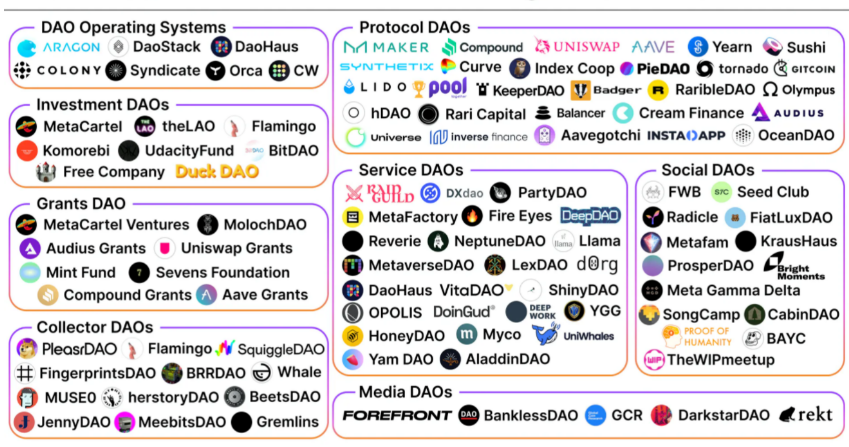

# DAO Tooling:

**Contribution Management:**&#x20;

The process by which a person moves from being unaware of the DAO to lurking on social media platforms (such as Twitter and Discord), connecting with other members, making their first contribution, and beyond is known as the contributor journey.&#x20;

The contributor journey should ideally cultivate a rising sense of ownership and belonging so that the person wants to advance with the community and have a greater impact on its goals.&#x20;

Members can complete quests and bounty activities in order to ”level up” in the DAO. Bounties are a good approach to give contributors a ”Good First Issue” to work on since they are well-defined in terms of scope and deliverables, even though they are merely the first step for onboarding contributors. If a task is on-chain, rewards can be automatically confirmed (Rabbit Hole) or left to the owner of the bounty’s discretion (Gitcoin, Coinvise).&#x20;

Yearn features a Telegram group dedicated to exposing jobs for interested participants and a dashboard that compiles open issues across their source repositories.

**Compensation:**&#x20;

Infrastructure for payment distribution is more developed than tooling in other organizational areas. Sablier or Superfluid allow DAOs to stream payments to contributors. Roll or disperse.app provide bulk token distribution. Gnosis Safe multisig allows DAOs to fund grants. Parcel and Multis allow DAOs to manage their treasury.&#x20;

By securing tokens in an options contract and broadcasting call options to contributors over a set vesting time, DAOs can potentially provide something comparable to an employee stock option plan (ESOP). The effectiveness of DeFi primitives.&#x20;

It is less obvious how distinct contributions should be honored. Activities like Github issues, PR contributions, and Discourse posts can be quantified and given ”cred” by tools like SourceCred. Govrn goes this a step further by working with specific DAOs to establish a ”Movement Model,” in which the community gives weight to various contributions based on its priorities, drawing inspiration from SourceCred.&#x20;

The wonderful thing about this is that value production can be standardized within the DAO. The community will decide what constitutes a contribution and how valuable each form of contribution is. This weighting is subject to change at any time through proposals.&#x20;

The notion behind Movement Models may vary greatly from one DAO to another. It shouldn’t be necessary for the community to refit itself to measurements that were established elsewhere. These bottom-up models can be integrated with unique voting mechanisms like quadratic trust, bounty creation, and reward distribution.&#x20;

The idea behind Coordinape, a peer-based remuneration method, is that members of a working group know best who has added the greatest value. Knowing the value that each contributor adds is at the edges as well because contribution originates there. At the conclusion of a work period (an ”epoch”), Coordinape allows team members to choose how to reward their coworkers. This eliminates the requirement for a central authority of incentive providers to precisely estimate value production (perhaps in an unreliable manner).&#x20;

For DAO contributors, one of the most under-addressed sectors is HR. Offering individuals a web3- native solution to manage ”meatspace” benefits like health insurance, 401ks, IRAs, and tax compliance is a major opportunity for projects.

These benefits are now connected to the employer rather than the specific employees, who are reliant on the suppliers and packages are chosen for them by an organization’s HR department. Additionally, if they quit the organization, they no longer receive these advantages. In addition to being a twisted relationship and a problem for independent contractors as a whole, this makes it nearly impossible for anyone to become ”full-time DAO” workers.&#x20;

One of the first web3 employment cooperatives geared for independent employees is called Opolis. The platform functions as a shared services layer independent of employers, providing its users with access to payroll, tax compliance, and employee benefit services. Opolis allows people the independence and flexibility to get paid by various DAOs while maintaining the HR advantages of a typical company by unbundling employment so that benefits are tied to the individual and not the employer.&#x20;

Opolis presently collaborates with members of the MakerDAO, Gitcoin, BadgerDAO, and more recently, ShapeShift projects. Although the platform only allows US citizens to join at the moment, it is one of the few that connects web2 stability and web3 self-sovereignty.

**Decision Making:**

Early DAO architectures include integrated governance mechanisms that tightly connect voting and on-chain execution (e.g. share-based voting in Moloch). Through their labor, members can acquire shares in the DAO. They can also voice their opinions by voting on proposals that, if approved, will result in on-chain action, such as the transfer of funds from the DAO’s treasury to a grant recipient.&#x20;

Gas prices have forced the ecosystem to separate voting from on-chain execution during the last year. Basic polling is carried out off-chain using Telegram, Discord, and Discourse polls or token-based signal voting with the aid of programs like Snapshot. Off-chain votes do record community sentiment, but a small number of admins ultimately control the execution (multisig signers).&#x20;

A different method of decision-making used by DAOs like Uniswap and Radicle is the proposal lifecycle, which involves signal voting in the early phases of a proposal’s development to improve it. The proposal does not move to an on-chain vote until all of the details are resolved. This strategy makes votes more ”meaningful” because they have an impact on the on-chain status (in the case of protocols). However, because communities must give members enough time to debate and vote on proposals, the **** entire process might take a while.&#x20;

A layer of checks and balances will be added to the next generation of governance tools to ensure that execution, even if it is started by a multi-sig, genuinely reflects the results of an off-chain vote. This will close the gap between off-chain voting and on-chain execution.&#x20;

A plugin called Gnosis SafeSnap uses an oracle to confirm that a choice was actually approved by the community through signal voting before a multi-sig conducts a transaction. As each transaction must first pass an off-chain vote in order to be performed, using this method of transaction verification prevents multi-sig signers from acting against the will of the community.&#x20;

The Gnosis team recently unveiled Zodiac along with its Reality module, making the aforementioned concept framework independent. Any off-chain event that can be communicated to the oracle (Discord polls, Discourse votes, etc.) might be utilized to start on-chain execution wherever the DAO resides in addition to signal votes on Snapshot translating into a Safe transaction.

**Treasury Management:**&#x20;

The treasury of a DAO is its source of life, which explains why multi-sigs and treasury committees are commonplace in the ecosystem. Moloch Guild Bank and DAO Stack Avatar are examples of money management solutions that are included out of the box with DAO frameworks, whereas Gnosis Safe has established itself as the multi-sig of choice for DAOs looking for more lightweight solutions. In addition, DAOs can diversify their holdings, make risk-adjusted investments, and generate revenue by utilizing the full stablecoin and DeFi ecosystem.&#x20;

To assess performance and financial health, DAO treasury management must now provide more transparency on its asset allocation and expenditure. Llama provides a method to classify fund input and outflow, associating expenditures with their related proposals where appropriate. One-click mass payouts in ETH or ERC-20s based on csv imports, regular payments, spending caps for members, and a dashboard that provides an overview of current asset allocations are all features of Parcel and MultiSafe.&#x20;

**Frontend and Analytics:**&#x20;

The architecture of crypto networks is extremely valuable thanks to block explorers like Etherscan. They give us insight into the nature of on-chain activities, and the patterns of network traffic, and they can even operate as rudimentary frontends for interacting with smart contracts.&#x20;

There is an increasing demand for human-readable DAO activity along with the growth of DAOs. An ”Etherscan for DAOs” would be a data aggregator and visualization tool that offers insights into the governance, expenditures, and records of current talks in the DAO, such as a contentious discussion about how to vote in other protocols or a large financing proposition.&#x20;

Members can visit Tally and Boardroom, which serve as governance frontends, to vote on ideas and view voter profiles and governance activity. We will eventually have an ”Etherscan for Governance” that provides insightful data on voter delegation relationships, qualitative data (explaining why voters voted the way they did), and community attitude over a certain proposal.&#x20;

Relationships between voter delegations provide important insight into a DAO’s social and political dynamics. A VC-funded DAO, for instance, where businesses have the majority of the voting power, will function differently than DAOs where individuals organize the community to delegate to them.&#x20;

A DAO analytics platform called DeepDAO rates DAOs according to criteria including member size, voting percentage, and treasury holdings. Additionally, it examines certain DAO members, highlighting those who are most engaged in DAOs in terms of membership, proposals made, and votes cast.

<figure><figcaption></figcaption></figure>

<figure><figcaption></figcaption></figure>
